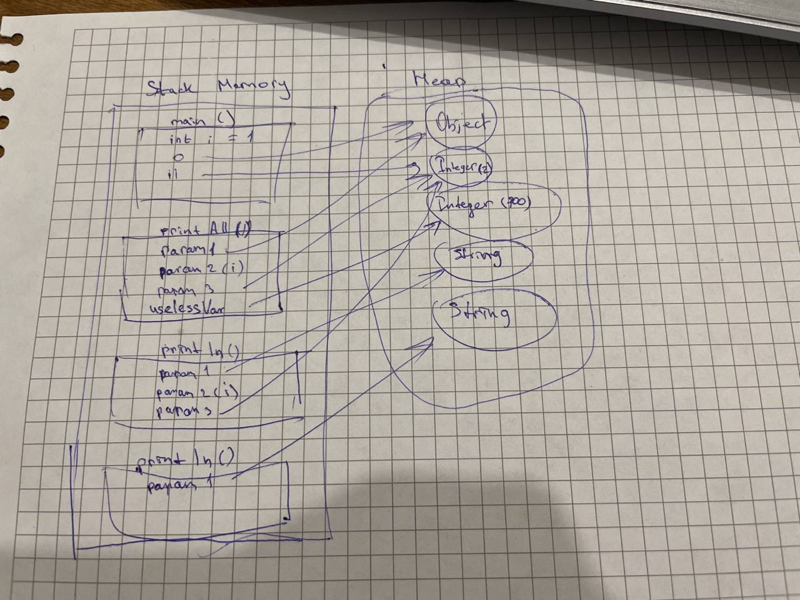

Задача "Понимание JVM"

Код для исследования


```
public class JvmComprehension {

    public static void main(String[] args) {
        int i = 1;                      // 1
        Object o = new Object();        // 2
        Integer ii = 2;                 // 3
        printAll(o, i, ii);             // 4
        System.out.println("finished"); // 7
    }

    private static void printAll(Object o, int i, Integer ii) {
        Integer uselessVar = 700;                   // 5
        System.out.println(o.toString() + i + ii);  // 6
    }
}
```

1. Загрузчик классов: подгружаются классы JvmComprehension, Integer, Object,
System. Далее выполняется проверка кода на валидность, подготовка (примитивны 
в статичесиких полях, таких у нас нет) и связываение ссылок на другие классы
   (связыванеи классов Comprehension, Integer, Object, System). 
Наконец то инициализация (у нас таких нет). 
2. Metaspace: все данные о классах попадаю в сюда, как и константы (которых
у нас нет). Размер установлен по дефолту (неогрничен)
3. Stack и Heap

Далее Stack будет отчищаться по очереди: println(param1), println(param1,
param2, param3), printAll(), main()
4. Execution Engin 
Будет выполняться интерпртатор, так как методы выполняются 1 раз
5. Сборка мусора будет выполняться 1 раз в конце выполнения программы, так 
как использование и размер объектов мал


     